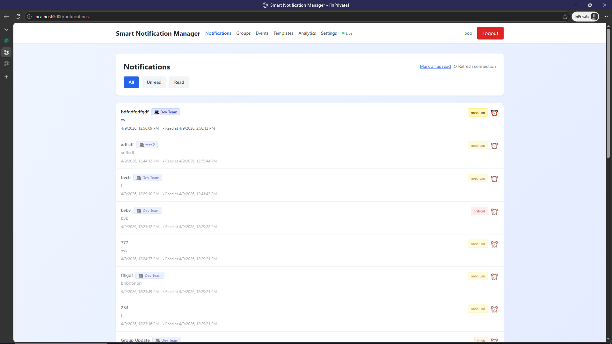
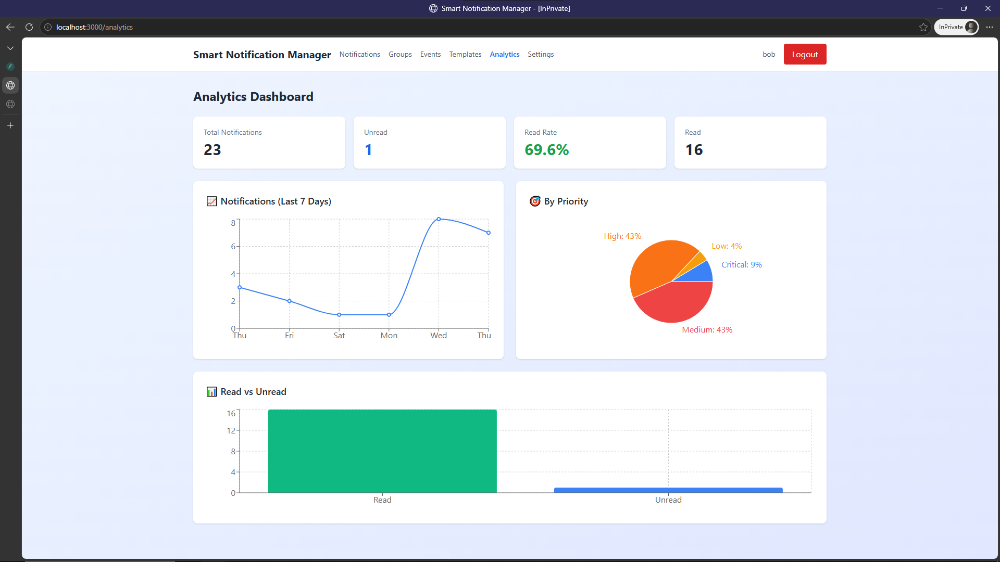

# Smart Notification Manager

Full-stack real-time notification management system with scheduled delivery, group targeting, analytics, and user preferences.

## Demo




*A real-time notification feed with WebSocket delivery, interactive analytics charts, and a settings panel for user preferences.*

---

## Product Context

### End Users
- **Team leads and managers** who need to broadcast updates to team members instantly
- **IT/DevOps engineers** who monitor system alerts and scheduled maintenance windows
- **Students and professionals** who want a centralized notification hub instead of scattered messages across multiple apps
- **Any user** who needs to schedule reminders, set quiet hours, or track notification read rates

### Problem It Solves
Important notifications get lost in email inboxes, chat streams, or browser tabs. Users miss time-sensitive updates, receive notifications at inconvenient hours, and have no way to schedule future announcements or track delivery metrics.

### Our Solution
A single web-based notification dashboard where users can:
- **Receive** notifications in real-time via WebSocket
- **Schedule** notifications for future delivery via Celery workers
- **Target** specific groups or individuals
- **Control** when they get notified (quiet hours, daily limits, digest mode)
- **Track** delivery metrics through an analytics dashboard

---

## Features

### Implemented

| Category | Feature | Status |
|----------|---------|--------|
| **Auth** | Register/login/logout with JWT + HTTP-only cookies | ✅ |
| **Auth** | Argon2 password hashing, rate limiting | ✅ |
| **Notifications** | Create with priority levels (low/medium/high/critical) | ✅ |
| **Notifications** | Real-time WebSocket delivery with auto-reconnect | ✅ |
| **Notifications** | Mark as read, mark all as read | ✅ |
| **Notifications** | Quick snooze (15m/1h/4h/1d/1w) per notification | ✅ |
| **Notifications** | Periodic auto-refresh (10s) as WebSocket fallback | ✅ |
| **Groups** | CRUD + member management (admin/member roles) | ✅ |
| **Events** | Schedule notifications for future date/time | ✅ |
| **Events** | Celery worker fires at scheduled time, marks as `sent` | ✅ |
| **Events** | Celery task revocation on event update/delete | ✅ |
| **Templates** | CRUD with categories, public/private visibility | ✅ |
| **Preferences** | Channel toggles, quiet hours, daily limits, timezone, digest | ✅ |
| **Analytics** | Line chart (daily activity), pie chart (by priority), bar chart (read vs unread) | ✅ |
| **Infrastructure** | Docker Compose, Nginx reverse proxy, Redis, Celery Beat | ✅ |
| **Database** | Alembic migrations, indexed queries | ✅ |

### Not Yet Implemented

| Feature | Description |
|---------|-------------|
| Email notifications | SMTP delivery channel |
| SMS notifications | SMS gateway integration |
| Recurring events | iCal RRULE parsing and re-scheduling |
| Notification digests | Scheduled summary emails |
| Template variable substitution | Auto-fill `{variables}` in templates |
| Unit tests | pytest + Vitest test suites |
| Audit logging | Track CRUD operations on entities |

---

## Usage

### Quick Start (Development)

```bash
# 1. Clone and configure
git clone <repo-url> se-toolkit-hackathon
cd se-toolkit-hackathon
cp .env.example .env

# 2. Start all services
docker compose up -d --build

# 3. Access the app
# Frontend:  http://localhost:3000
# API Docs:  http://localhost:8000/docs
# Health:    http://localhost:8000/health
```

### User Flow

1. **Register** a new account at http://localhost:3000/register
2. **Login** and land on the Notifications dashboard
3. **Create a notification** via the API or WebSocket — it appears instantly
4. **Create a group**, add members, send group notifications
5. **Schedule an event** — notification fires at the chosen date/time
6. **Browse templates** and reuse common notification patterns
7. **Adjust preferences** in Settings (quiet hours, daily limits, timezone)
8. **View analytics** to track read rates and notification volume

### API Testing

```bash
# Register
curl -X POST http://localhost:8000/api/v1/auth/register \
  -H "Content-Type: application/json" \
  -d '{"email":"user@test.com","username":"user","password":"SecurePass1!"}'

# Login (saves HTTP-only cookie)
curl -c cookies.txt -X POST http://localhost:8000/api/v1/auth/login \
  -H "Content-Type: application/json" \
  -d '{"email":"user@test.com","password":"SecurePass1!"}'

# Create notification
curl -b cookies.txt -X POST http://localhost:8000/api/v1/notifications \
  -H "Content-Type: application/json" \
  -d '{"title":"Alert","message":"System update in 1 hour","priority":"high"}'

# List notifications
curl -b cookies.txt http://localhost:8000/api/v1/notifications
```

---

## Deployment

### Target Platform
- **OS**: Ubuntu 24.04 LTS (or equivalent Linux distribution)
- **Architecture**: x86_64 / amd64

### Prerequisites (what must be installed on the VM)

```bash
# Docker Engine
curl -fsSL https://get.docker.com | sh
sudo usermod -aG docker $USER

# Docker Compose plugin (included in Docker Desktop / official apt repo)
sudo apt install docker-compose-plugin -y

# Verify installation
docker --version          # 27+
docker compose version    # 2.29+
```

No other software needs to be installed on the host — all services run in containers.

### Step-by-Step Deployment

```bash
# 1. Clone the repository
git clone <repo-url> se-toolkit-hackathon
cd se-toolkit-hackathon

# 2. Configure environment
cp .env.example .env
# Edit .env and change JWT_SECRET, DB_PASSWORD for production
```

#### Option A: Development Mode (hot-reload, no reverse proxy)

```bash
docker compose up -d --build

# Services available on:
#   Frontend: http://<host-ip>:3000
#   API:      http://<host-ip>:8000
#   API Docs: http://<host-ip>:8000/docs
```

#### Option B: Production Mode (Nginx reverse proxy, Celery Beat)

```bash
docker compose -f docker-compose.yml -f docker-compose.v2.yml --profile production up -d

# Services available on:
#   Frontend + API: http://<host-ip>   (port 80, via Nginx)
#   Flower (Celery monitoring): http://<host-ip>:5555
```

### Services Running

| Service        | Dev Port | Prod Port | Description                    |
|----------------|----------|-----------|--------------------------------|
| Frontend       | 3000     | 80 (nginx)| React app with Vite HMR        |
| Backend        | 8000     | 80 (nginx)| FastAPI API server             |
| PostgreSQL     | 5432     | internal  | Primary database               |
| Redis          | 6379     | internal  | Celery broker + WebSocket cache|
| Celery Worker  | —        | internal  | Background task processor      |
| Celery Beat    | —        | internal  | Scheduled task scheduler       |
| Nginx          | —        | 80        | Production reverse proxy       |

### Exposing Ports to Host (for development access to DB/Redis)

The `docker-compose.yml` already maps ports 5432, 6379, 3000, and 8000 to the host. In production mode, remove the port mappings from frontend/backend and access everything through Nginx on port 80.

### Stopping Services

```bash
# Development
docker compose down

# Production
docker compose -f docker-compose.yml -f docker-compose.v2.yml --profile production down

# Remove volumes (deletes all data)
docker compose down -v
```

---

## License

This project is open-source under the [MIT License](LICENSE).
